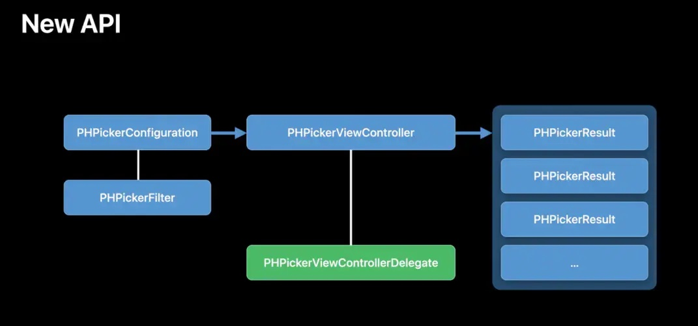

# iOS相册看这一篇文章就够了——Photos框架 & PHPickerController

### 前言

苹果在iOS14继续加强了对用户隐私的保护，有时需求只是想选择一张相册中的图片，但是需要对App开发整个照片库的权限，一些私密照片也可以被App读取到，这样很不合理！因此iOS14中对相册权限新增了 **"Limited Photo Library Access"** 模式，这样用户可以控制App允许访问的照片。下面简单介绍下如何适配iOS14相册新增的功能，以及如何使用Photos框架自定义相册页面。文中的API使用可以参考[Demo](https://github.com/whlpkk123/Photo)


### PHPhotoLibrary新增API

PHPhotoLibrary用于获取查看相册权限，处理相册变化，注册监听相册变化，监听用户添加/删除了哪些照片。

使用相册权限，必须在工程的info.plist文件中添加`NSPhotoLibraryUsageDescription`，否则会启动崩溃。

* 权限枚举

```objective-c
typedef NS_ENUM(NSInteger, PHAuthorizationStatus) {
    PHAuthorizationStatusNotDetermined = 0, // 用户未作出选择
    PHAuthorizationStatusRestricted,        // 此App无权限访问照片数据
    PHAuthorizationStatusDenied,            // 用户已明确拒绝此应用程序访问照片数据
    PHAuthorizationStatusAuthorized,        // 用户已授权此应用程序访问照片数据
    PHAuthorizationStatusLimited API_AVAILABLE(ios(14)), // 用户已授权此应用程序进行有限照片库访问
};  
```

* 权限等级枚举

```objective-c
typedef NS_ENUM(NSInteger, PHAccessLevel) {
    PHAccessLevelAddOnly = 1,     // 仅允许添加
    PHAccessLevelReadWrite = 2,   // 读写
} API_AVAILABLE(macos(11.0), ios(14), tvos(14));
```

* 权限获取

新权限获取：增加了权限等级

``` objective-c
// 获取指定等级的权限
+ (PHAuthorizationStatus)authorizationStatusForAccessLevel:(PHAccessLevel)accessLevel API_AVAILABLE(macosx(11.0), ios(14), tvos(14));

// 请求指定等级的权限
+ (void)requestAuthorizationForAccessLevel:(PHAccessLevel)accessLevel handler:(void(^)(PHAuthorizationStatus status))handler API_AVAILABLE(macosx(11.0), ios(14), tvos(14)) NS_SWIFT_ASYNC(2);
```

旧权限获取:在iOS14中已经废弃，建议使用上面的新API

``` objective-c
+ (PHAuthorizationStatus)authorizationStatus API_DEPRECATED_WITH_REPLACEMENT("+authorizationStatusForAccessLevel:", ios(8, API_TO_BE_DEPRECATED), macos(10.13, API_TO_BE_DEPRECATED), tvos(10, API_TO_BE_DEPRECATED));

+ (void)requestAuthorization:(void(^)(PHAuthorizationStatus status))handler API_DEPRECATED_WITH_REPLACEMENT("+requestAuthorizationForAccessLevel:handler:", ios(8, API_TO_BE_DEPRECATED), macos(10.13, API_TO_BE_DEPRECATED), tvos(10, API_TO_BE_DEPRECATED));
```

> 注意：如果仍使用旧的API未适配iOS14新特性，这时获取相册权限状态，就算在Limited 模式下也会返回Authorized


### 新增 PHPickerController 

iOS 14 中系统新增了一个图片选择器PHPicker ( iOS14 以上使用)，官方建议使用 PHPicker 来替代原有的 UIImagePickerController ( iOS14 以下使用)进行图片选择 。UIImagePickerController 只能选中一张图片已经不符合需求了，将逐渐被废弃替换。

* **使用PHPickerController**



1. 使用 PHPickerConfiguration 配置 PHPicker，键 selectionLimit 设置为 n 表示最多可选中 n 张图片，0 为 maximum，默认值为1；使用 filter 设置想要的相册资源类型，包括 imagesFilter、videosFilter、livePhotosFilter，亦可以设置为数组@[ videoFilter , livePhotosFilter ]显示多种类型.
2. 设置 PHPickerViewControllerDelegate 代理，接收选中照片后的回调；
3. 在代理回调 piscker:didFinishPicking: 中处理返回结果 PHPickerResult;

* **PHPickerController的优点** 

1. PHPicker 使用的独立的进程获取相册数据，所以不会影响App的性能，解决了之前自定义相册，图片吃内存的问题。

2. 因为 PHPicker 使用的系统独立进程，当用户选中所选照片时，也只会回调相应照片的图片信息，所以不需要App申请权限，也不受新增的限制模式的影响。换句话说，如果只使用了 PHPicker ，则完成不需要在代码里面申请权限，info.plist 文件里面也不需要申请权限，直接使用即可。
3. 支持多选。
4. 支持按照 image，video，livePhotos 类型进行选择。
5. 支持搜索，页面上有搜索框。

* **PHPickerController的缺点** 

1. 不支持选中图片的编辑，例如选中后裁剪成正方形，需要自定义实现了；
2. 不能直接获取到 PHAsset ，如果想要获取，则需要获取用户权限，使用户授权。


* **PHPickerController 代码 Demo 演示** 

```objective-c
#import <PhotosUI/PhotosUI.h> //头文件

- (IBAction)openPhotoLibrary:(id)sender {
    PHPickerConfiguration *config = [[PHPickerConfiguration alloc] init];
    config.selectionLimit = 1;
    config.filter = [PHPickerFilter imagesFilter];
    PHPickerViewController *pickVC = [[PHPickerViewController alloc] initWithConfiguration:config];
    pickVC.delegate = self;
    [self presentViewController:pickVC animated:YES completion:nil];
}

- (void)picker:(PHPickerViewController *)picker didFinishPicking:(NSArray<PHPickerResult *> *)results {
    if (results == nil || results.count <= 0) {
        NSLog(@"选择照片失败");
    } else {
        PHPickerResult *result = [results firstObject];
        if ([result.itemProvider canLoadObjectOfClass:[UIImage class]]) {
            __weak __typeof(self)weakSelf = self;
            [result.itemProvider loadObjectOfClass:[UIImage class] completionHandler:^(__kindof id<NSItemProviderReading>  _Nullable object, NSError * _Nullable error) {
                if (!error) {
                    UIImage *tmpImage = (UIImage *)object;
                    NSLog(@"选择照片成功");
                } else {
                    NSLog(@"选择照片失败");
                }
            }];
        } else {
            NSLog(@"选择照片失败");
        }
    }
    [picker dismissViewControllerAnimated:YES completion:nil];
}

```

更多详细内如可以参考：[WWDC视频： Meet the new Photos picker](https://developer.apple.com/videos/play/wwdc2020/10652/)

### Photos 框架使用

Photos 框架是iOS 8之后用于替代AssetsLibrary的一个现代化框架，几年以来，相机应用与照片应用发生了显著的变化，增加了许多新特性，Photos可以获取相册中的所有图片和视频资源，包括iCloud Photo library 和 Live Photos，并且能够异步获取并缓存缩略图和原图。主要用来开发自定义相册、对资源进行处理等能力。

#### 资源

```objective-c
@interface PHObject : NSObject <NSCopying>
// Returns an identifier which persistently identifies the object on a given device
@property (nonatomic, copy, readonly) NSString *localIdentifier; //标识资源的唯一标识符
@end
```

相册中有两种资源，分别是`PHAsset` 和 `PHCollection`，都继承自`PHObject`。`PHAsset`代表一个相册中的文件，这个文件可以是视频、音频或照片，我们可以通过`PHAsset`来获取这个文件相应的元信息以及标识符`localIdentifier`，包括定位、创建时间、名称等等。而`PHCollection`则是一个集合，`PHCollection`有两个子类分别是`PHAssetCollection`和`PHCollectionList`，其中`PHAssetCollection`代表一个相册，也就是PHAsset的集合。`PHCollectionList`代表一个自身的集合，也就是`PHCollection`的集合，通常用来获取相册列表。


##### PHAsset

PHAsset可以获取文件的元数据以及描述符，不包含资源本身的内容，所以对内存的占用较小。如果需要获取内容本身，请参考[获取资源内容章节](#content)。它有如下几个重要属性：

```objective-c
//资源类型
typedef NS_ENUM(NSInteger, PHAssetMediaType) {
    PHAssetMediaTypeUnknown = 0,
    PHAssetMediaTypeImage   = 1,  //图片
    PHAssetMediaTypeVideo   = 2,  //视频
    PHAssetMediaTypeAudio   = 3,  //音频
};

//资源子类型
typedef NS_OPTIONS(NSUInteger, PHAssetMediaSubtype) {
    PHAssetMediaSubtypeNone               = 0,
    
    // Photo subtypes
    PHAssetMediaSubtypePhotoPanorama      = (1UL << 0),  //全景图(Panorama)
    PHAssetMediaSubtypePhotoHDR           = (1UL << 1),  //HDR图片
    PHAssetMediaSubtypePhotoScreenshot API_AVAILABLE(ios(9)) = (1UL << 2), //屏幕截图
    PHAssetMediaSubtypePhotoLive API_AVAILABLE(ios(9.1)) = (1UL << 3),    //livePhoto
    PHAssetMediaSubtypePhotoDepthEffect API_AVAILABLE(macos(10.12.2), ios(10.2), tvos(10.1)) = (1UL << 4), //人像景深模式

    
    // Video subtypes
    PHAssetMediaSubtypeVideoStreamed      = (1UL << 16),
    PHAssetMediaSubtypeVideoHighFrameRate = (1UL << 17),
    PHAssetMediaSubtypeVideoTimelapse     = (1UL << 18),
    PHAssetMediaSubtypeVideoCinematic API_AVAILABLE(macos(12), ios(15), tvos(15)) = (1UL << 21),
};

//资源来源类型
typedef NS_OPTIONS(NSUInteger, PHAssetSourceType) {
    PHAssetSourceTypeNone            = 0,
    PHAssetSourceTypeUserLibrary     = (1UL << 0), //用户相册
    PHAssetSourceTypeCloudShared     = (1UL << 1), //iCloud
    PHAssetSourceTypeiTunesSynced    = (1UL << 2), //iTunes同步
} API_AVAILABLE(ios(9));

@property (nonatomic, assign, readonly) PHAssetMediaType mediaType; //资源类型,图片或者音频或视频
@property (nonatomic, assign, readonly) PHAssetMediaSubtype mediaSubtypes; //资源子类型
@property (nonatomic, assign, readonly) NSUInteger pixelWidth;   //像素宽
@property (nonatomic, assign, readonly) NSUInteger pixelHeight;  //像素高
@property (nonatomic, strong, readonly, nullable) NSDate *creationDate; //创建时间
@property (nonatomic, strong, readonly, nullable) NSDate *modificationDate; //修改时间
@property (nonatomic, strong, readonly, nullable) CLLocation *location; //图片位置
@property (nonatomic, assign, readonly) NSTimeInterval duration; //视频时长
@property (nonatomic, assign, readonly, getter=isHidden) BOOL hidden; //资源是否被用户标记为"隐藏"
@property (nonatomic, assign, readonly, getter=isFavorite) BOOL favorite; //资源是否被用户标记资源为"收藏"
@property (nonatomic, assign, readonly) PHAssetSourceType sourceType; //资源来源类型，可以来源自用户相册、iCloud、iTunes同步

//连拍模式相关，
@property (nonatomic, strong, readonly, nullable) NSString *burstIdentifier;//在连拍模式下拍摄的一组照片具有同一个burstIdentifier作为标识，如果想要获取连拍照片中的剩余的其他照片，可以通过将这个值传入 fetchAssetsWithBurstIdentifier(...) 方法来获取
@property (nonatomic, assign, readonly) PHAssetBurstSelectionType burstSelectionTypes;
@property (nonatomic, assign, readonly) BOOL representsBurst; //标识这个资源是一系列连拍照片中的代表照片 (多张照片是在用户按住快门时拍摄的)。
```

##### PHAssetCollection

`PHAssetCollection`是一组有序的资源集合,包括相册、moments、智能相册以及共享照片流.它的重要属性如下：

```objective-c
typedef NS_ENUM(NSInteger, PHAssetCollectionType) {
    PHAssetCollectionTypeAlbum      = 1, //从 iTunes 同步来的相册，以及用户在 Photos 中自己建立的相册 
    PHAssetCollectionTypeSmartAlbum = 2, //系统生成的智能相册，eg:人物、地点等 
    PHAssetCollectionTypeMoment     API_DEPRECATED("Will be removed in a future release", ios(8, 13), tvos(10, 13)) API_UNAVAILABLE(macos) = 3,
};

typedef NS_ENUM(NSInteger, PHAssetCollectionSubtype) {
    
    // PHAssetCollectionTypeAlbum regular subtypes
    PHAssetCollectionSubtypeAlbumRegular         = 2,
    PHAssetCollectionSubtypeAlbumSyncedEvent     = 3,
    PHAssetCollectionSubtypeAlbumSyncedFaces     = 4,
    PHAssetCollectionSubtypeAlbumSyncedAlbum     = 5,
    PHAssetCollectionSubtypeAlbumImported        = 6,
    
    // PHAssetCollectionTypeAlbum shared subtypes
    PHAssetCollectionSubtypeAlbumMyPhotoStream   = 100,
    PHAssetCollectionSubtypeAlbumCloudShared     = 101,
    
    // PHAssetCollectionTypeSmartAlbum subtypes
    PHAssetCollectionSubtypeSmartAlbumGeneric    = 200,
    PHAssetCollectionSubtypeSmartAlbumPanoramas  = 201,
    PHAssetCollectionSubtypeSmartAlbumVideos     = 202,
    PHAssetCollectionSubtypeSmartAlbumFavorites  = 203,
    PHAssetCollectionSubtypeSmartAlbumTimelapses = 204,
    PHAssetCollectionSubtypeSmartAlbumAllHidden  = 205,
    PHAssetCollectionSubtypeSmartAlbumRecentlyAdded = 206,
    PHAssetCollectionSubtypeSmartAlbumBursts     = 207,
    PHAssetCollectionSubtypeSmartAlbumSlomoVideos = 208,
    PHAssetCollectionSubtypeSmartAlbumUserLibrary = 209,
    PHAssetCollectionSubtypeSmartAlbumSelfPortraits API_AVAILABLE(ios(9)) = 210,
    PHAssetCollectionSubtypeSmartAlbumScreenshots API_AVAILABLE(ios(9)) = 211,
    PHAssetCollectionSubtypeSmartAlbumDepthEffect API_AVAILABLE(macos(10.13), ios(10.2), tvos(10.1)) = 212,
    PHAssetCollectionSubtypeSmartAlbumLivePhotos API_AVAILABLE(macos(10.13), ios(10.3), tvos(10.2)) = 213,
    PHAssetCollectionSubtypeSmartAlbumAnimated API_AVAILABLE(macos(10.15), ios(11), tvos(11)) = 214,
    PHAssetCollectionSubtypeSmartAlbumLongExposures API_AVAILABLE(macos(10.15), ios(11), tvos(11)) = 215,
    PHAssetCollectionSubtypeSmartAlbumUnableToUpload API_AVAILABLE(macos(10.15), ios(13), tvos(13)) = 216,
    PHAssetCollectionSubtypeSmartAlbumRAW API_AVAILABLE(macos(12), ios(15), tvos(15)) = 217,
    PHAssetCollectionSubtypeSmartAlbumCinematic API_AVAILABLE(macos(12), ios(15), tvos(15)) = 218,


    // Used for fetching, if you don't care about the exact subtype
    PHAssetCollectionSubtypeAny = NSIntegerMax
};

@property (nonatomic, assign, readonly) PHAssetCollectionType assetCollectionType;  //相册类型
@property (nonatomic, assign, readonly) PHAssetCollectionSubtype assetCollectionSubtype; //相册子类型

// These counts are just estimates; the actual count of objects returned from a fetch should be used if you care about accuracy. Returns NSNotFound if a count cannot be quickly returned.
@property (nonatomic, assign, readonly) NSUInteger estimatedAssetCount; //估算的asset数量

@property (nonatomic, strong, readonly, nullable) NSDate *startDate; //相册的创建时间
@property (nonatomic, strong, readonly, nullable) NSDate *endDate; //collection内最近一个文件的更新时间

```

#### 获取资源请求

* PHAsset都是通过类方法获取对应的资源的，具体API如下：

```objective-c
//获取具体的图片、视频
@interface PHAsset : PHObject
 
//获取一个相册中的所有文件
+ (PHFetchResult<PHAsset *> *)fetchAssetsInAssetCollection:(PHAssetCollection *)assetCollection options:(nullable PHFetchOptions *)options;
//通过identifiers获取文件
+ (PHFetchResult<PHAsset *> *)fetchAssetsWithLocalIdentifiers:(NSArray<NSString *> *)identifiers options:(nullable PHFetchOptions *)options; // includes hidden assets by default
+ (nullable PHFetchResult<PHAsset *> *)fetchKeyAssetsInAssetCollection:(PHAssetCollection *)assetCollection options:(nullable PHFetchOptions *)options;
//通过burstIdentifier获取PHAsset,burstIdentifier是连拍模式才会有的id，通过该id可以获取连拍模式的所有照片
+ (PHFetchResult<PHAsset *> *)fetchAssetsWithBurstIdentifier:(NSString *)burstIdentifier options:(nullable PHFetchOptions *)options API_AVAILABLE(macos(10.15));

// Fetches PHAssetSourceTypeUserLibrary assets by default (use includeAssetSourceTypes option to override)
+ (PHFetchResult<PHAsset *> *)fetchAssetsWithOptions:(nullable PHFetchOptions *)options API_AVAILABLE(macos(10.15));
+ (PHFetchResult<PHAsset *> *)fetchAssetsWithMediaType:(PHAssetMediaType)mediaType options:(nullable PHFetchOptions *)options API_AVAILABLE(macos(10.15));

// assetURLs are URLs retrieved from ALAsset's ALAssetPropertyAssetURL
+ (PHFetchResult<PHAsset *> *)fetchAssetsWithALAssetURLs:(NSArray<NSURL *> *)assetURLs options:(nullable PHFetchOptions *)options API_DEPRECATED("Will be removed in a future release", ios(8, 11), tvos(8, 11)) API_UNAVAILABLE(macos);

@end

```

* PHCollection同样是通过类方法获取对应的资源的，具体API如下：

```objective-c
@interface PHAssetCollection : PHCollection

// Fetch asset collections of a single type matching the provided local identifiers (type is inferred from the local identifiers)
//通过LocalIdentifier和option获取相册
+ (PHFetchResult<PHAssetCollection *> *)fetchAssetCollectionsWithLocalIdentifiers:(NSArray<NSString *> *)identifiers options:(nullable PHFetchOptions *)options;

// Fetch asset collections of a single type and subtype provided (use PHAssetCollectionSubtypeAny to match all subtypes)
// 通过相册类型获取相册
+ (PHFetchResult<PHAssetCollection *> *)fetchAssetCollectionsWithType:(PHAssetCollectionType)type subtype:(PHAssetCollectionSubtype)subtype options:(nullable PHFetchOptions *)options;

// Smart Albums are not supported, only Albums and Moments
// 检索某个asset对象所在的集合
+ (PHFetchResult<PHAssetCollection *> *)fetchAssetCollectionsContainingAsset:(PHAsset *)asset withType:(PHAssetCollectionType)type options:(nullable PHFetchOptions *)options;

@end
```

##### PHFetchOptions

获取资源的选项配置，我们可以设置获取asset的条件,比如获取哪种资源，如何分类等。获取的时候，如果该参数为空，则使用系统的默认值，当我们调用如上所示方法获取时，可以直接传nil。

```objective-c
@interface PHFetchOptions : NSObject <NSCopying>

// Some predicates / sorts may be suboptimal and we will log
@property (nonatomic, strong, nullable) NSPredicate *predicate;  //做选择的约束条件。比如，只获取图片，不获取视频。指定 PHAssetMediaType为image.
@property (nonatomic, strong, nullable) NSArray<NSSortDescriptor *> *sortDescriptors; //可指定字段用来对获取结果进行排序

// Whether hidden assets are included in fetch results. Defaults to NO
@property (nonatomic, assign) BOOL includeHiddenAssets; // 是否包含隐藏的资源

// Whether hidden burst assets are included in fetch results. Defaults to NO
@property (nonatomic, assign) BOOL includeAllBurstAssets API_AVAILABLE(macos(10.15)); //是否包含连拍的照片

// The asset source types included in the fetch results.  Defaults to PHAssetSourceTypeNone.
// If set to PHAssetSourceTypeNone the asset source types included in the fetch results are inferred from the type of query performed (see PHAsset fetchAssetsWithOptions:)
@property (nonatomic, assign) PHAssetSourceType includeAssetSourceTypes API_AVAILABLE(ios(9)); //包含的资源来源类型

// Limits the maximum number of objects returned in the fetch result, a value of 0 means no limit.  Defaults to 0.
@property (nonatomic, assign, readwrite) NSUInteger fetchLimit API_AVAILABLE(ios(9)); //获取资源的数量限制

// Whether the owner of this object is interested in incremental change details for the results of this fetch (see PHChange)
// Defaults to YES
@property (nonatomic, assign) BOOL wantsIncrementalChangeDetails;

@end
```

##### PHFetchResult

> When you use class methods on the [`PHAsset`](https://developer.apple.com/documentation/photokit/phasset), [`PHCollection`](https://developer.apple.com/documentation/photokit/phcollection), [`PHAssetCollection`](https://developer.apple.com/documentation/photokit/phassetcollection), and [`PHCollectionList`](https://developer.apple.com/documentation/photokit/phcollectionlist) classes to retrieve objects, Photos provides the resulting objects in a fetch result. You access the contents of a fetch result with the same methods and conventions used by the [`NSArray`](https://developer.apple.com/documentation/foundation/nsarray) class. Unlike an `NSArray` object, however, a `PHFetchResult` object dynamically loads its contents from the Photos library as needed, providing optimal performance even when handling a large number of results.
>
> A fetch result provides thread-safe access to its contents. After a fetch, the fetch result’s [`count`](https://developer.apple.com/documentation/photokit/phfetchresult/1620996-count) value is constant, and all objects in the fetch result keep the same [`localIdentifier`](https://developer.apple.com/documentation/photokit/phobject/1622400-localidentifier) value. (To get updated content for a fetch, register a change observer with the shared [`PHPhotoLibrary`](https://developer.apple.com/documentation/photokit/phphotolibrary) object.)
>
> A fetch result caches its contents, keeping a batch of objects around the most recently accessed index. Because objects outside of the batch are no longer cached, accessing these objects results in refetching those objects. This process can result in changes to values previously read from those objects.

上面是苹果官网对PHFetchResult的描述，翻译过来的大致意思如下：

在使用 PHAsset、PHCollection、PHAssetCollection 和 PHCollectionList 类的类方法检索对象时，Photos 会在获取结果中生成的对象。您可以使用与 NSArray 类相同的方法和约定来访问获取结果的内容。但与 NSArray 对象不同的是，**PHFetchResult 对象会根据需要从照片库动态加载其内容**，即使在处理大量结果时也能提供最佳性能。

**PHFetchResult提供了对其内容的线程安全访问**。取回结果后，取回结果的数量保持不变，**取回结果中的所有对象都保持相同的 localIdentifier 值**。(要获取获取结果的更新内容，请向共享的 PHPhotoLibrary 对象注册一个变化观测器）。

**PHFetchResult结果会缓存其内容**，在最近访问的索引周围保留一批对象。由于批次之外的对象不再被缓存，访问这些对象会导致重新获取这些对象。这一过程可能会导致之前从这些对象中读取的值发生变化。

<a id="content"></a>

#### 获取资源内容

##### PHImageManager

PHImageManager是一个专门请求图像与视频的类。每次请求完成后，会对已请求的图像与视频作缓存。当下次使用相同的图像与视频时，会更快的返回结果。

```objective-c
@interface PHImageManager : NSObject
...
+ (PHImageManager *)defaultManager; //全局单列，返回PHImageManager的实例
...
@end

```

**PHImageManager请求图片资源API**

```objective-c
// 请求指定asset的图像。
- (PHImageRequestID)requestImageForAsset:(PHAsset *)asset targetSize:(CGSize)targetSize contentMode:(PHImageContentMode)contentMode options:(nullable PHImageRequestOptions *)options resultHandler:(void (^)(UIImage *_Nullable result, NSDictionary *_Nullable info))resultHandler;

// 请求指定asset的图像数据。
- (PHImageRequestID)requestImageDataAndOrientationForAsset:(PHAsset *)asset options:(nullable PHImageRequestOptions *)options resultHandler:(void (^)(NSData *_Nullable imageData, NSString *_Nullable dataUTI, CGImagePropertyOrientation orientation, NSDictionary *_Nullable info))resultHandler API_AVAILABLE(macos(10.15), ios(13), tvos(13));

// 取消图片请求
- (void)cancelImageRequest:(PHImageRequestID)requestID;
```

这里重点讲下第一个方法，请求data和请求image类似。

管理器会加载或生成一张图像并通过resultHandler返回这张图像。为了更快的返回，管理器会返回一张目标大小或接近目标大小的图像给你，因为可能之前已经缓存过该图像或生成接近的图像更有效率。
**一般来说，回调是异步的并且可以回调多次**，通过设置PHImageRequestOptions的synchronous为YES来同步回调，同步时只会回调一次，且不能通过cancelImageRequest取消。
默认情况下，第一次调用回调一般会返回一个合适的低质量图像作为临时展示，然后管理器会去生成一个高质量的图像。当成功生成了高质量的图像后，管理器再次调用resultHandler来返回这张图像。若管理器已经缓存了请求图像的高质量图像，管理器只会调用一次resultHandler并直接返回高质量图像。可通过resultHandler中的info中的PHImageResultIsDegradedKey判断是否为高质量图像。

这个方法的行为有很多种情况，具体视PHImageRequestOptions的配置，注意不要踩坑。这里重点讲下PHImageRequestOptions相关属性：

```objective-c
@property (nonatomic, assign) PHImageRequestOptionsVersion version; //图像的版本
typedef NS_ENUM(NSInteger, PHImageRequestOptionsVersion) {
    PHImageRequestOptionsVersionCurrent = 0, //若图像进行了编辑，会返回编辑后的版本
    PHImageRequestOptionsVersionUnadjusted,  //返回没做任何调整的原始版本
    PHImageRequestOptionsVersionOriginal //返回原始版本，如果是组合格式，则将返回最高保真度格式（例如RAW表示RAW + JPG源图像）
};

@property (nonatomic, assign) PHImageRequestOptionsDeliveryMode deliveryMode; //交付模式
typedef NS_ENUM(NSInteger, PHImageRequestOptionsDeliveryMode) {
    PHImageRequestOptionsDeliveryModeOpportunistic = 0,     //默认 异步调用时可能会得到多个图像结果，或者在同步调用时会得到一个结果
    PHImageRequestOptionsDeliveryModeHighQualityFormat = 1,     //只会得到一个结果，它将是所要求的或比之更好的结果
    PHImageRequestOptionsDeliveryModeFastFormat = 2     //只会得到一个结果，它可能会是降级的结果 
};

@property (nonatomic, assign) PHImageRequestOptionsResizeMode resizeMode; //调整大小模式，当targetSize为PHImageManagerMaximumSize时不生效. 默认是PHImageRequestOptionsResizeModeFast
typedef NS_ENUM(NSInteger, PHImageRequestOptionsResizeMode) {
    //不调整大小
    PHImageRequestOptionsResizeModeNone = 0, 
    //默认 
    //当源图像为压缩格式（即二次采样）时，会使用targetSize作为最佳解码的大小，但交付的图像可能大于targetSize
    PHImageRequestOptionsResizeModeFast, 
    //与上述相同，但交付的图像等于targetSize（必须在设置normalizedCropRect时才生效）
    PHImageRequestOptionsResizeModeExact, 
};

@property (nonatomic, assign) CGRect normalizedCropRect; //在原始图像的单位坐标中指定的裁剪矩形。默认为CGRectZero。当resizeMode = PHImageRequestOptionsResizeModeExact才生效。

@property (nonatomic, assign, getter=isNetworkAccessAllowed) BOOL networkAccessAllowed; //允许从iCloud下载图像，默认为NO。可以通过progressHandler监视或取消下载

@property (nonatomic, assign, getter=isSynchronous) BOOL synchronous; //是否同步请求图像，默认为NO。YES仅返回一个结果，会阻塞线程直到请求成功（或失败）。

@property (nonatomic, copy, nullable) PHAssetImageProgressHandler progressHandler; //当从iCloud下载图像时，将会回调该handler，默认为nil

@property (nonatomic) BOOL allowSecondaryDegradedImage API_AVAILABLE(macos(14), ios(17), tvos(17)); // 除了返回初始降级结果外，如果条件允许，还将返回另一个降级结果。

@end
```

然后来详细讲下，图像获取的其他相关参数

* asset: 要加载其图像数据的PHAsset
* targetSize: 要返回的图像的目标尺寸,PHImageManagerMaximumSize表示最大尺寸（即原图），结果不一定等于这个size，视PHImageRequestOptions的配置情况而定。
* contentMode: 图像自适应模式。当图像的宽高比与目标尺寸不一致时，通过contentMode决定该如何适应。

```objective-c
typedef NS_ENUM(NSInteger, PHImageContentMode) {
    //压缩模式 图像的长边与目标尺寸一致，短边则比例缩小，小于目标尺寸。
    PHImageContentModeAspectFit = 0,
    //伸展模式 图像的短边与目标尺寸一致，长边则比例放大，大于目标尺寸。
    PHImageContentModeAspectFill = 1,
    //默认
    PHImageContentModeDefault = PHImageContentModeAspectFit
};
```

* resultHandler 在当前线程上同步或在主线程上异步调用一次或多次的回调block。`void (^)(UIImage *_Nullable result, NSDictionary *_Nullable info)`
  * result 请求成功的图像。
  * info 图像的信息，字典的key value如下
    * PHImageResultIsInCloudKey ——NSNumber\<Bool\> 。资源在iCloud上，需要发出新请求（PHImageRequestOptions.networkAccessAllowed = YES）才能获得结果
    * PHImageResultIsDegradedKey ——NSNumber\<Bool\>。返回的图像是降级的（仅针对异步请求），这意味着将获取其他图像，除非与此同时取消请求。如果本地数据不可用且networkAccessAllowed不为YES，则请求可能会失败。
    * PHImageResultRequestIDKey ——NSNumber。请求的id
    * PHImageCancelledKey ——NSNumber。结果不可用，因为请求已被取消
    * PHImageErrorKey ——NSError。获取失败的错误
  
* 返回值PHImageRequestID，请求的id，可通过调用`cancelImageRequest`取消请求，只能取消异步的请求。

对于视频以及音频，小伙伴可以自行查阅资料

##### PHCachingImageManager

PHCachingImageManager 是PHImageManager的子类，其能力除了父类的获取资源能力外，还多了预先缓存图像与视频能力，以便请求的时候能更快返回。

```objective-c
@interface PHCachingImageManager : PHImageManager

// During fast scrolling clients should set this to improve responsiveness
@property (nonatomic, assign) BOOL allowsCachingHighQualityImages; // 默认值为YES。如果设置为YES，图像管理器将会准备高质量的图像。这个选项将在高性能成本下提供更好的图像。想要有更快更好的性能——比如说用户快速的滑动缩略图集合视图的时候——设置这个属性为NO。

// Asynchronous image preheating (aka caching), note that only image sources are cached (no crop or exact resize is ever done on them at the time of caching, only at the time of delivery when applicable).
// The options values shall exactly match the options values used in loading methods. If two or more caching requests are done on the same asset using different options or different targetSize the first
// caching request will have precedence (until it is stopped)
- (void)startCachingImagesForAssets:(NSArray<PHAsset *> *)assets targetSize:(CGSize)targetSize contentMode:(PHImageContentMode)contentMode options:(nullable PHImageRequestOptions *)options;
- (void)stopCachingImagesForAssets:(NSArray<PHAsset *> *)assets targetSize:(CGSize)targetSize contentMode:(PHImageContentMode)contentMode options:(nullable PHImageRequestOptions *)options;
- (void)stopCachingImagesForAllAssets;

@end
```

翻译过来：异步图像预热（也称为缓存），请注意，只有图像资源会被缓存（在缓存时不会进行裁剪或精确调整大小，只有在传递时才会进行）。 options必须与加载方法中使用的options完全匹配。如果对同一资源进行两个或更多的缓存请求，使用不同的选项或不同的目标大小，则第一个缓存请求将优先（直到停止为止）。

PHCachingImageManager 的实例最好由业务自己创建，而不要用父类的defaultManager，便于控制自己业务的图片缓存&释放。
